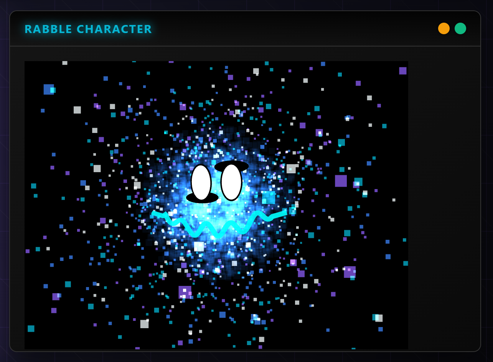

# RabbleOS 3D - Web Operating System



A complete web-based operating system built around a 3D AI character interface. The system provides a tiling window manager with three main applications: a 3D character display, a terminal interface, and an editor for testing the render engine.

## 🎯 **System Overview**

RabbleOS 3D is a modern web operating system featuring:

- **Tiling Window Manager**: Clean, responsive CSS Grid-based layout
- **3D AI Character**: Interactive Rabble character with real-time animation
- **Terminal Interface**: Command-line interface with 20+ commands
- **Editor Application**: Visual interface for render engine testing
- **Rabble Energy Theme**: Cyberpunk purple/cyan aesthetic
- **Framework Agnostic**: Works in any modern browser

## 🏗️ **Architecture**

### **Window Layout**
```
┌─────────────────┬─────────────┐
│                 │             │
│   Editor App    │  Rabble 3D  │
│   (Largest)     │  (Small,    │
│                 │   Permanent)│
├─────────────────┼─────────────┤
│                               │
│        Terminal App           │
│         (Full width)          │
│                               │
└───────────────────────────────┘
```

### **Core Components**
- **RabbleOS** (`js/RabbleOS.js`) - Main operating system logic
- **RabbleCanvas** (`js/RabbleCanvas.js`) - 3D character component
- **Terminal** (`js/terminal.js`) - Command-line interface
- **Editor** (`js/editor.js`) - Visual testing interface
- **Rabble Theme** (`style/RabbleTheme.css`) - Cyberpunk aesthetic
- **OS Layout** (`style/RabbleOS.css`) - Window management styles

## 🚀 **Quick Start**

### **Basic Usage**
```html
<!DOCTYPE html>
<html lang="en">
<head>
    <title>RabbleOS 3D</title>
    <link rel="stylesheet" href="style/RabbleTheme.css">
    <link rel="stylesheet" href="style/RabbleOS.css">
</head>
<body class="rabble-theme">
    <!-- RabbleOS will be loaded here -->
    <script src="https://cdnjs.cloudflare.com/ajax/libs/three.js/r128/three.min.js"></script>
    <script src="js/config.js"></script>
    <script src="js/RabbleRenderer.js"></script>
    <script src="js/AnimationController.js"></script>
    <script src="js/RabbleBody.js"></script>
    <script src="js/RabbleMouth.js"></script>
    <script src="js/RabbleEyes.js"></script>
    <script src="js/Rabble.js"></script>
    <script src="js/RabbleCanvas.js"></script>
    <script src="js/RabbleOS.js"></script>
    <script src="js/terminal.js"></script>
    <script src="js/editor.js"></script>
</body>
</html>
```

### **Terminal Commands**
```bash
# Rabble Control
rabble speak              # Make Rabble speak
rabble listen             # Put Rabble in listening mode
rabble react              # Trigger reaction animation
rabble idle               # Return to idle state

# Interaction
rabble lookat 1 0 0       # Make Rabble look at coordinates

# System
system status             # Show system status
test animation            # Open animation studio

# Configuration
save config               # Save current configuration
load config               # Load configuration from file

# Testing
test speak                # Test speaking function
test listen               # Test listening function
test react                # Test reaction function
test idle                 # Test idle function
```

### **Editor Controls**
The editor provides real-time sliders for:
- **Mouth Intensity**: Control waveform intensity (0.0 to 3.0)
- **Wave Amplitude**: Control wave animation amplitude (0.0 to 2.0)
- **Eye Position**: Control eye movement (X and Y axes)
- **Particle Size**: Control energy particle size (0.05 to 1.0)
- **Particle Opacity**: Control particle transparency (0.0 to 1.0)

## 📁 **File Structure**

```
RabbleOS_3D/
├── index.html                    # Main OS interface
├── js/
│   ├── RabbleOS.js              # Main OS logic & window management
│   ├── terminal.js              # Terminal application logic
│   ├── editor.js                # Editor application logic
│   ├── RabbleCanvas.js          # 3D Character Web Component
│   ├── RabbleRenderer.js        # Three.js scene management
│   ├── AnimationController.js   # State machine for animations
│   ├── RabbleBody.js            # Particle system for energy effect
│   ├── RabbleMouth.js           # Animated waveforms
│   ├── RabbleEyes.js            # Camera-facing eyes with portals
│   └── [other components]
├── style/
│   ├── RabbleOS.css             # OS layout and window management styles
│   ├── RabbleTheme.css          # Rabble Energy aesthetic theme
│   └── [other styles]
├── docs/                        # Documentation
│   ├── architecture.md          # System architecture overview
│   ├── components.md            # Component documentation
│   ├── terminal.md              # Terminal API documentation
│   ├── editor.md                # Editor functionality
│   └── api.md                   # Complete API reference
└── Extras/                      # Additional tools and examples
    ├── animation-studio.html    # Advanced animation interface
    └── test-system.html         # System testing interface
```

## 🎨 **Rabble Energy Theme**

The system uses a cyberpunk purple/cyan color scheme:

```css
:root {
    --rabble-cyan: #06B6D4;
    --rabble-purple: #8B5CF6;
    --rabble-red: #EF4444;
    --rabble-panel: #151515;
    --rabble-border: #333333;
}
```

## 🔧 **API Reference**

### **RabbleCanvas Methods**
```javascript
const rabble = document.querySelector('rabble-canvas');

// Animation Control
rabble.speak();                    // Trigger speaking animation
rabble.listen();                   // Enter listening state
rabble.react();                    // Trigger reaction animation
rabble.idle();                     // Return to idle state

// Interaction Control
rabble.lookAt(x, y, z);            // Control eye movement

// Configuration
rabble.setMouthPolynomial(index, coeffs, degree);  // Control mouth animation
rabble.setParticleSizeRange(min, max);             // Control particle effects
rabble.setParticleOpacity(opacity);                // Control particle transparency

// Save/Load
rabble.saveConfiguration(filename);                // Save current state
rabble.loadConfigurationFromFile(file);            // Load from file
rabble.loadConfigurationFromObject(config);        // Load from object
```

### **Terminal Integration**
```javascript
// Terminal commands are processed automatically
// Example: Type "rabble speak" in terminal to trigger speaking animation
```

### **Editor Integration**
```javascript
// Editor controls update RabbleCanvas in real-time
// Sliders and buttons provide immediate visual feedback
```

## 📖 **Documentation**

Comprehensive documentation is available in the `docs/` folder:

- **[Architecture](docs/architecture.md)** - System overview and component relationships
- **[Components](docs/components.md)** - Detailed component documentation
- **[Terminal](docs/terminal.md)** - Terminal application API and commands
- **[Editor](docs/editor.md)** - Editor application features and controls
- **[API](docs/api.md)** - Complete API reference for all components

## 🎮 **Features**

### **Rabble 3D Character**
- Particle-based energy body with purple-to-blue gradient
- Animated waveform mouth responding to speech
- Camera-facing eyes with portal-like effects
- State-based animation system (idle, speaking, listening, reacting)
- Real-time property control (position, scale, animation parameters)

### **Terminal Application**
- Real-time command processing with 20+ available commands
- Command history with arrow key navigation
- Integration with Rabble character controls
- System status monitoring
- Configuration save/load functionality

### **Editor Application**
- Real-time control sliders for all Rabble parameters
- Test buttons for all animation states
- Configuration save/load functionality
- Integration with terminal commands
- Animation studio integration

### **Window Management**
- CSS Grid-based tiling window manager
- Responsive design that adapts to different screen sizes
- Smooth animations and hover effects
- Non-closable Rabble window (permanent display)
- Minimize/maximize functionality for other windows

## 🚀 **Development**

### **Prerequisites**
- Modern browser with WebGL support
- Three.js r128+ (loaded via CDN)
- Web Components v1 support

### **Development Workflow**
1. Open `index.html` to see the complete RabbleOS
2. Use browser developer tools for debugging
3. Modify `js/config.js` for customization
4. Edit component files for feature development
5. Update documentation in `docs/` folder

### **Performance Optimization**
- **Particle Count**: Configurable particle count (default: 800)
- **LOD System**: Ready for Level-of-Detail implementation
- **Memory Management**: Proper cleanup of Three.js objects
- **Animation Loop**: Optimized render loop with delta time

## 🌐 **Browser Support**

- **Modern Browsers**: Chrome, Firefox, Safari, Edge
- **WebGL Support**: Required for 3D rendering
- **Web Components**: v1 support required
- **ES6+ Features**: Arrow functions, classes, modules

## 🤝 **Contributing**

1. Fork the repository
2. Create a feature branch
3. Make your changes
4. Add documentation
5. Submit a pull request

## 📄 **License**

This project is licensed under Custom License - see the LICENSE file for details.

## 🙏 **Acknowledgments**

- **Three.js** - 3D graphics library
- **Web Components** - Custom element framework
- **Cyberpunk Aesthetic** - Inspired by retro-futuristic design
- **Tiling Window Managers** - Inspired by i3, Hyprland, and others
