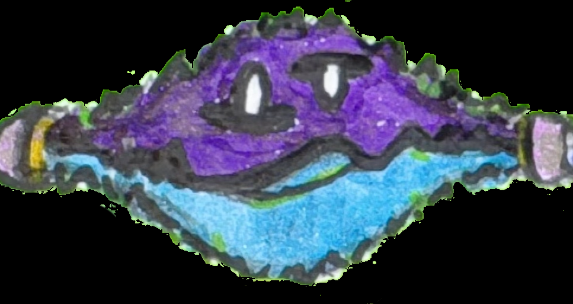

# Rabble - 3D AI Character Interface

A lightweight, portable 3D character built with Three.js for Agentic Web OS interfaces.

## Concept Art

The character design is inspired by the concept art in `RabbleConcept01.afphoto` and `RabbleConcept01.png`. Rabble is an artificial intelligence entity made of energy, serving as the main user interface for interacting with Agentic Web OS systems.

**Key Design Elements:**
- **Energy Body**: Particle-based form with purple-to-blue gradient representing pure energy
- **Waveform Mouth**: Animated waveforms that flow through the center, responding to speech and interaction
- **Portal Eyes**: Camera-facing circular eyes with portal-like eyebrow arches above and below
- **Dark Background**: Black void environment emphasizing the energy nature



## Features

- **Particle-based energy body** with purple-to-blue gradient
- **Animated waveform mouth** that responds to speech and interaction
- **Camera-facing eyes** with portal-like eyebrow arches
- **State-based animation system** (idle, speaking, listening, reacting)
- **Web Component architecture** for easy integration
- **Framework-agnostic** - works in any web environment

## Quick Start

### Basic Usage

```html
<!DOCTYPE html>
<html>
<head>
    <script src="https://cdnjs.cloudflare.com/ajax/libs/three.js/r128/three.min.js"></script>
</head>
<body>
    <rabble-canvas id="my-rabble"></rabble-canvas>

    <script src="js/config.js"></script>
    <script src="js/RabbleRenderer.js"></script>
    <script src="js/AnimationController.js"></script>
    <script src="js/RabbleBody.js"></script>
    <script src="js/RabbleMouth.js"></script>
    <script src="js/RabbleEyes.js"></script>
    <script src="js/Rabble.js"></script>
    <script src="js/RabbleCanvas.js"></script>
    <script src="js/index.js"></script>

    <script>
        // Control the character
        const rabble = document.getElementById('my-rabble');
        rabble.speak();    // Make mouth animate intensely
        rabble.listen();   // Subtle listening animation
        rabble.react();    // Excited reaction
        rabble.lookAt(1, 0, 0); // Look right
    </script>
</body>
</html>
```

### React/Vue Integration

```jsx
// React example
import React, { useRef, useEffect } from 'react';

function RabbleComponent() {
  const rabbleRef = useRef(null);

  useEffect(() => {
    // Load scripts if not already loaded
    // Then control via ref
    if (rabbleRef.current) {
      rabbleRef.current.speak();
    }
  }, []);

  return <rabble-canvas ref={rabbleRef} />;
}
```

## API Reference

### RabbleCanvas Web Component

#### Methods
- `speak()` - Trigger speaking animation
- `listen()` - Enter listening state
- `stopListening()` - Exit listening state
- `react()` - Trigger reaction animation
- `lookAt(x, y, z)` - Make eyes look at coordinates

#### Properties
- `getRabble()` - Get direct access to Rabble instance
- `getRenderer()` - Get Three.js renderer
- `getScene()` - Get Three.js scene
- `getCamera()` - Get Three.js camera

## Configuration

Edit `js/config.js` to customize:

```javascript
const CONFIG = {
    colors: {
        body: { inner: 0x8B5CF6, outer: 0x3B82F6 }, // Purple to blue
        mouth: 0x06B6D4,                             // Cyan
        background: 0x000000                         // Black
    },
    particles: {
        count: 800,       // Performance vs visual quality
        size: 2.5         // Particle size
    },
    // ... more options
};
```

## Architecture

- **`RabbleCanvas`** - Web Component wrapper
- **`Rabble`** - Main character class
- **`RabbleBody`** - Particle system for energy effect
- **`RabbleMouth`** - Animated waveforms
- **`RabbleEyes`** - Camera-facing eyes with portals
- **`AnimationController`** - State machine for behaviors
- **`RabbleRenderer`** - Three.js scene management

## Performance

- **~800 particles** for smooth 60fps on most devices
- **No textures** - pure geometry for lightweight rendering
- **Normal blending** for proper depth layering
- **LOD-ready** - easily reduce particle count for lower-end devices

## Browser Support

- Modern browsers with WebGL support
- Tested with Three.js r128+
- Web Components v1 support required

## Development

1. Open `index.html` for basic demo
2. Open `test.html` for interactive testing
3. Check browser console for errors
4. Modify `js/config.js` for customization

## Files

```
RabbleOS_3D/
├── RabbleConcept01.afphoto  # Affinity Photo concept art file
├── RabbleConcept01.png      # PNG export of concept art
├── index.html               # Basic demo
├── test.html                # Interactive test page
├── js/
│   ├── config.js            # Configuration settings
│   ├── RabbleRenderer.js    # Three.js scene management
│   ├── AnimationController.js # State machine
│   ├── RabbleBody.js        # Particle system
│   ├── RabbleMouth.js       # Waveform animations
│   ├── RabbleEyes.js        # Eye system
│   ├── Rabble.js            # Main character class
│   ├── RabbleCanvas.js      # Web Component
│   └── index.js             # Module exports
└── README.md                # This file
```